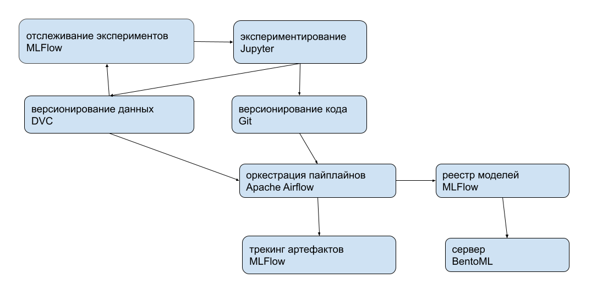

# Прогнозирование вляния аварии на дорожный трафик

Это набор данных об автомобильных авариях в 49 штатах США. Данные об авариях собираются с февраля 2016 г. по декабрь 2020 г. с использованием нескольких API, которые предоставляют потоковые данные о дорожно-транспортных происшествиях (или событиях). В настоящее время в этом наборе данных содержится около 1,5 миллиона записей об авариях.

Требуется предсказать тяжесть аварии (Severity) по шкале от 1 до 4, где 1 указывает на наименьшее влияние на движение (т. е. короткая задержка в результате аварии), а 4 указывает на значительное влияние на движение (т. е. длительное опоздание) по остальным признакам датасета (кроме ID).

Страница датасета на Kaggle: https://www.kaggle.com/datasets/sobhanmoosavi/us-accidents/versions/10

Блокнот: [notebooks/us_accidents.ipynb](notebooks/us_accidents.ipynb)

## MLOps

DAG в Apache Airflow собирает модель, регистрирует её в MLFlow, собирает Docker-образ с BentoML и моделью внутри. Она доступна по http://localhost:5001. Данные версионируются в DVC отдельно от кода. Для экспериментов &mdash; Jupyter Notebook.



Установка Poetry:

```
curl -sSL https://install.python-poetry.org | python3 -
```

Установка python-зависимостей:

```
poetry install
```

Запуск блокнота:

```
poetry run jupyter notebook &
```

Запуск MLFLow:

```
poetry run mlflow ui &
```

Инициализация Apache Airflow (один раз):

```
AIRFLOW_HOME=$(pwd) poetry run airflow db init

AIRFLOW_HOME=$(pwd) poetry run airflow users create \
    --username admin \
    --firstname Peter \
    --lastname Parker \
    --role Admin \
    --email spiderman@superhero.org
```

Установите в airflow.cfg:
```
load_examples = False
```

Запуск Apache Airflow:

```
AIRFLOW_HOME=$(pwd) poetry run airflow webserver --port 8080 &
AIRFLOW_HOME=$(pwd) poetry run airflow scheduler &
```
